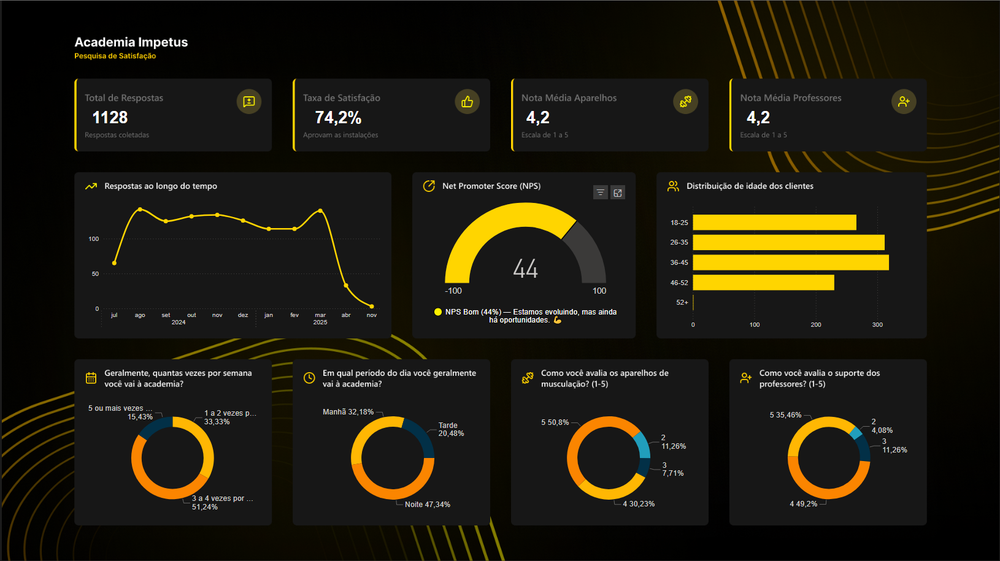
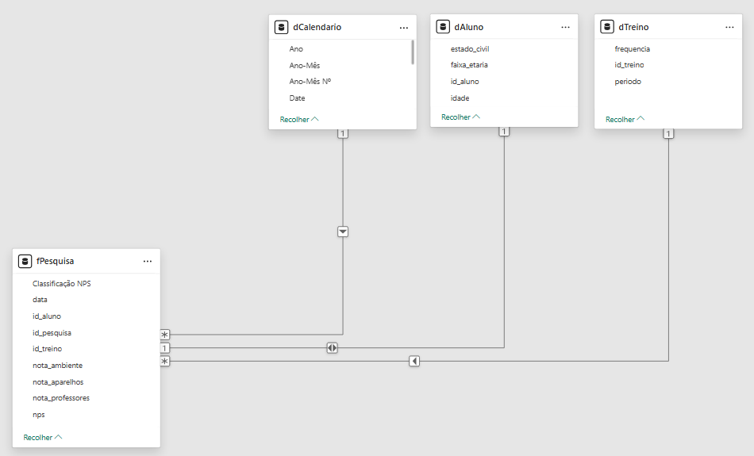

# Dashboard de Pesquisa de Satisfação - Academia Impetus

Este projeto tem como objetivo monitorar a satisfação dos clientes e a qualidade dos serviços da Academia Impetus. A análise baseia-se em dados reais coletados via pesquisa de satisfação, visando identificar pontos de melhoria no atendimento, infraestrutura e retenção de clientes.


<!--  -->
## Dashboard Interativo

Para uma melhor experiência e para testar a interatividade dos filtros e visuais, o dashboard está disponível publicamente no link abaixo:

**[Acesse o dashboard interativo aqui](https://app.fabric.microsoft.com/view?r=eyJrIjoiNmI1MjAxZWEtNjUwMi00N2VjLTk5NDUtZDVmNjNjZTU0YjhlIiwidCI6ImQ0MDY5MTM4LWE2MTAtNDFjOC1iZDhkLWM3OWEwZjdlZmJlOCJ9)**

**[Visualize o design do dashboard no Figma](https://www.figma.com/design/lGndbYWedEUREcGRG1fliB/Academia-Impetus---Dashboard-Pesquisa-de-Satisfa%C3%A7%C3%A3o?node-id=0-1&t=mGPkaHIWVlRq5jsP-1)**

**[Visualize o Formulario de Pesquisa](https://forms.gle/ksyuGL4QPkFKNSrp7)**

## Contexto do Projeto

Este dashboard foi desenvolvido para atender às demandas estratégicas da área de Customer Experience, com foco nos seguintes objetivos de negócio:

* Monitorar e melhorar continuamente a satisfação dos clientes.
* Identificar pontos críticos na jornada do cliente para aprimorar o atendimento e a infraestrutura.
* Acompanhar métricas-chave de retenção e fidelização de clientes.
* Fornecer insights acionáveis para a tomada de decisão baseada em dados.

## Arquitetura da Solução no Power BI

O projeto foi estruturado seguindo as boas práticas do Power BI, dividido em quatro etapas principais:

### 1\. Extração e Transformação (ETL) com Power Query

* **Fontes de Dados:** Os dados foram coletados atráves de um formulário digital (Google Forms).

* **Tratamento de Dados:**
 O Power Query foi utilizado para realizar a transformação dos dados, garantindo consistência e qualidade. As principais etapas incluíram:
  * Ajuste de tipos de dados, como formatação de datas, valores numéricos e textos.
  * Criação de colunas calculadas para facilitar a modelagem e análise.

* **Transformação de Dados:** O script em Python carrega um arquivo Excel com respostas dp questionário, transforma os dados em três tabelas (duas "dimensão" e uma "fato") e salva essas tabelas em CSV dentro da pasta dados. As principais etapas incluíram:
  * Carregar os dados.
  * Renomeia colunas.
  * Criar tabelas dimensão e fato
  * Preparar os arquivos para serem carregados no PBI.

### 2\. Modelagem de Dados (Esquema Estrela)

Foi implementado um **Esquema Estrela** (Star Schema) para otimizar a performance das consultas DAX.

* **Tabela Fato:** `fPesquisa` (contendo chaves estrangeiras, notas, nps, etc.)
* **Tabelas de Dimensão:**
  * `dCalendario` (conectada à `fPesquisa` pela data)
  * `dAluno` (conectada pela `id_aluno`, contém Idade, Faixa Etária, Estado Civil)
  * `dTreino` (conectada pela `id_treino`, contém Período e Frequência)


<!--  -->
### 3\. Cálculos e Medidas (DAX)

Todas as métricas de negócio foram criadas usando **DAX (Data Analysis Expressions)** para garantir cálculos dinâmicos e precisos. As principais medidas incluem:

```CSS
Md. Aparelhos = AVERAGE(fPesquisa[nota_aparelhos])
```

```CSS
Md. Atendimento = AVERAGE(fPesquisa[nota_atendimento])
```

```CSS
Md. Infraestrutura = AVERAGE(fPesquisa[nota_infraestrutura])
```

```CSS
Md. Professores = AVERAGE(fPesquisa[nota_professores])
```

```CSS
Qtd. Detratores = 
  CALCULATE(
    [Qtd. Pesquisas],
    fPesquisa[Classificação NPS] = "Detrator"
  )
```

```CSS
Qtd. Promotores = 
  CALCULATE(
    [Qtd. Pesquisas],
      fPesquisa[Classificação NPS] = "Promotor"
  )
```

```CSS
Taxa Satisfação = 
DIVIDE(
    CALCULATE(
        [Qtd. Pesquisas],
        'fPesquisa'[nota_ambiente] >= 4
    ),
    [Qtd. Pesquisas]
)
```

```CSS
NPS = 
  VAR promotores =
    DIVIDE([Qtd. Promotores], [Qtd. Pesquisas])
      
  VAR detratores =
    DIVIDE([Qtd. Detratores], [Qtd. Pesquisas])

  VAR NPS = (promotores - detratores) * 100

  RETURN
      NPS
```

### 4\. Visualização de Dados (Relatório)

O relatório foi construído em uma única página para uma "Visão Geral", contendo:

* **Cards de KPIs:** 4 cartões `(Total de Pesquisas, Taxa de Satisfação, Média Aparelhos, Média Professores)` com indicadores de performance.
* **Gráfico de Linha:** `Evolução do NPS ao longo do tempo`.
* **Gráfico de Colunas:** `Distribuição de idade dos clientes`.
* **Gráfico de Rosca:** `(Avaliação academia, periodo, dias, professores e aparelhos)`.

## Como Usar o Arquivo .pbix

Para explorar o modelo de dados, as consultas do Power Query e todas as medidas DAX:

1. **Requisito:** Você precisa ter o **[Power BI Desktop](https://powerbi.microsoft.com/pt-br/desktop/)** instalado em sua máquina.
2. **Download:** Baixe o arquivo `.pbix` deste repositório.
3. **Abra o arquivo:** Abra o arquivo `.pbix` no Power BI Desktop.
4. **Explore:**
      * Acesse a guia **"Exibição de Modelo"** (ícone de diagrama) para ver o Esquema Estrela.
      * Acesse a guia **"Exibição de Dados"** (ícone de tabela) para ver as tabelas.
      * Acesse **"Transformar dados"** na faixa de opções para abrir o Power Query e ver o ETL.
      * Clique nas medidas (na barra de "Dados" à direita) para ver o código DAX na barra de fórmulas.
      * Modifique o caminho das pastas em `caminho_pasta`.

## 🧑‍💻 Autor

### Jefferson Evangelista de Noronha

* [Linkedin](https://www.linkedin.com/in/jeffnoronha/)
* [GitHub](https://github.com/jeffnoronha1)
